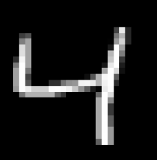

# Rank1-Rank5-Accuracy

In this repo I wanted to share my Rank-1 and Rank-5 accuracy code. 

## Model
The model used for this repo is simple neural network model. It has 100 neurons in dense layer and 10 neurons second dense layer (output layer) to classify digits.
The dataset is MNIST handwritten dataset.
Some examples from train dataset: 

  
  
  

And some examples from test dataset:

  
  
  

## What is Rank-1 accuracy?
Rank-1 accuracy is simply accuracy we use models most of times. It takes the highest probability class from the prediction of model and compares it with actual label. If they both are same then it will return true, otherwise false.

At 10th cell the model evaluation with test dataset is Rank-1 accuracy.
I also used Rank-1 accuracy for testing model performance with images I drew paint. We can see that model's result is 30%. It found 9 classes true in 30 images. Let's see what will be Rank-5 accuracy of model on this images.

## What is Rank-5 accuracy?
Rank-5 accuracy is used when we have many number of classes. This time it takes top 5 highest probability classes from the prediction of model and if the true label is in these 5 classes it returns true, otherwise false. For example:

Let's assume model predicts letters from images and we sent it 'J' to predict, and it returns these probabilities:

L - 41%

T - 29%

J - 12%

I - 10%

Y - 5%  ...

If we use Rank-5 accuracy to evaluate we'll say prediction is false. But if we use Rank-5 accuracy to evaluate then we say prediction is true even if it predicted J with 12% confidence and 3rd place. We say true because J is in top-5 list.

As you can see at 88th cell I used argmax function to take the highest probability. And at 89th cell I used '==' operator in 'if' statement.

And at 91th cell you can see I used argsort and list slicing to take top-5 probability. And at 92th cell I used 'in' operator in 'if' statement.
